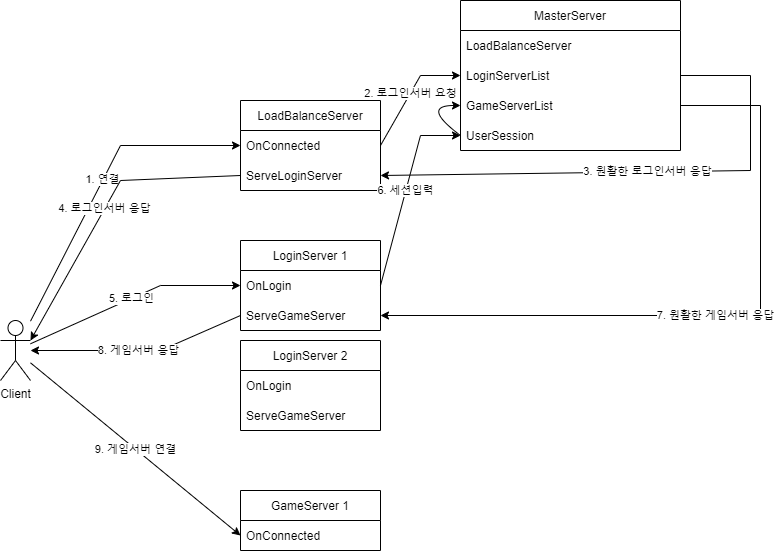

# CSharpMMOGameServerPractice

C#으로 구현하는 연습용 MMO 게임서버

## Goal

1. 소켓 통신
2. 분산 처리 서버 구조 (User feel like single server.)
3. 자체 분산 객체 또는 캐시 서버 구현 (without Memcached or Redis)
4. 자체 서버 간 통신 구현 (without gRPC or Zookeeper)

## Architecture

## TODO

1. 소켓 래핑
2. 서버 간 통신(IPC, RPC) 구현
3. MasterServer 구현
4. LoadBalanceServer 구현
5. LoginServer 구현
6. GameServer 구현
